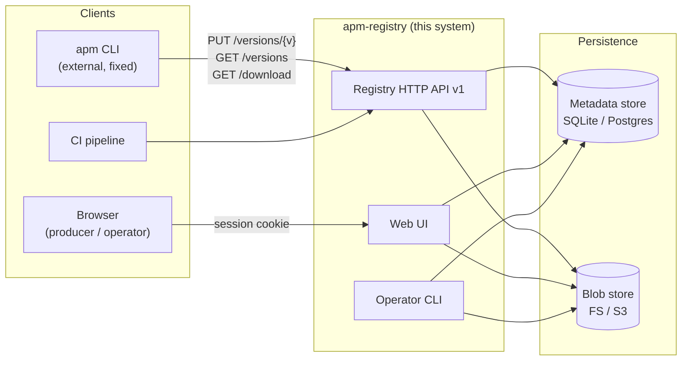
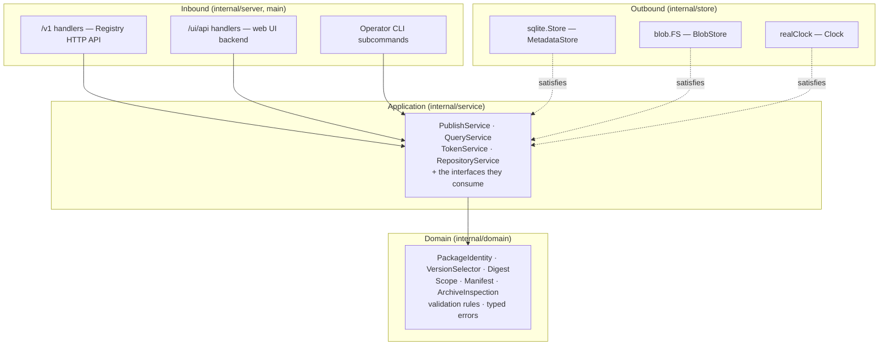
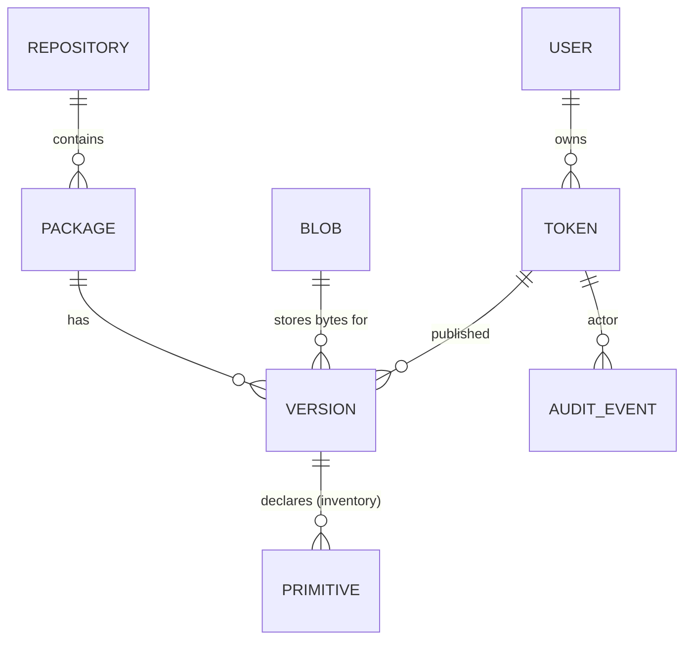
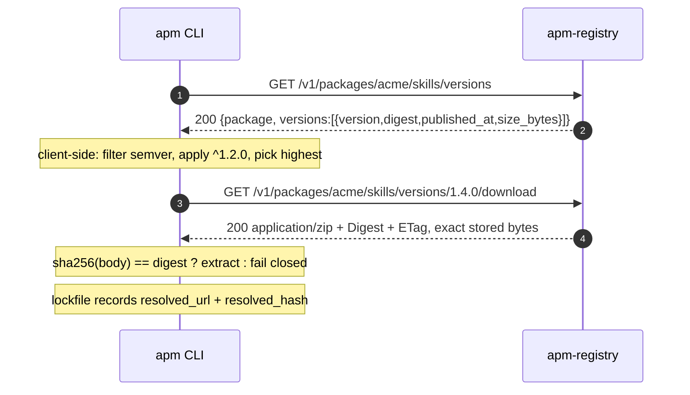
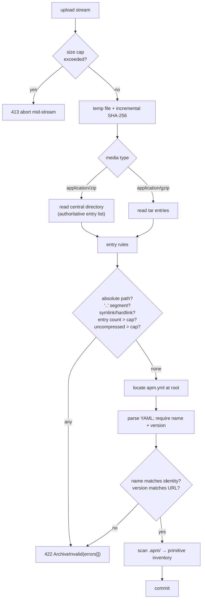
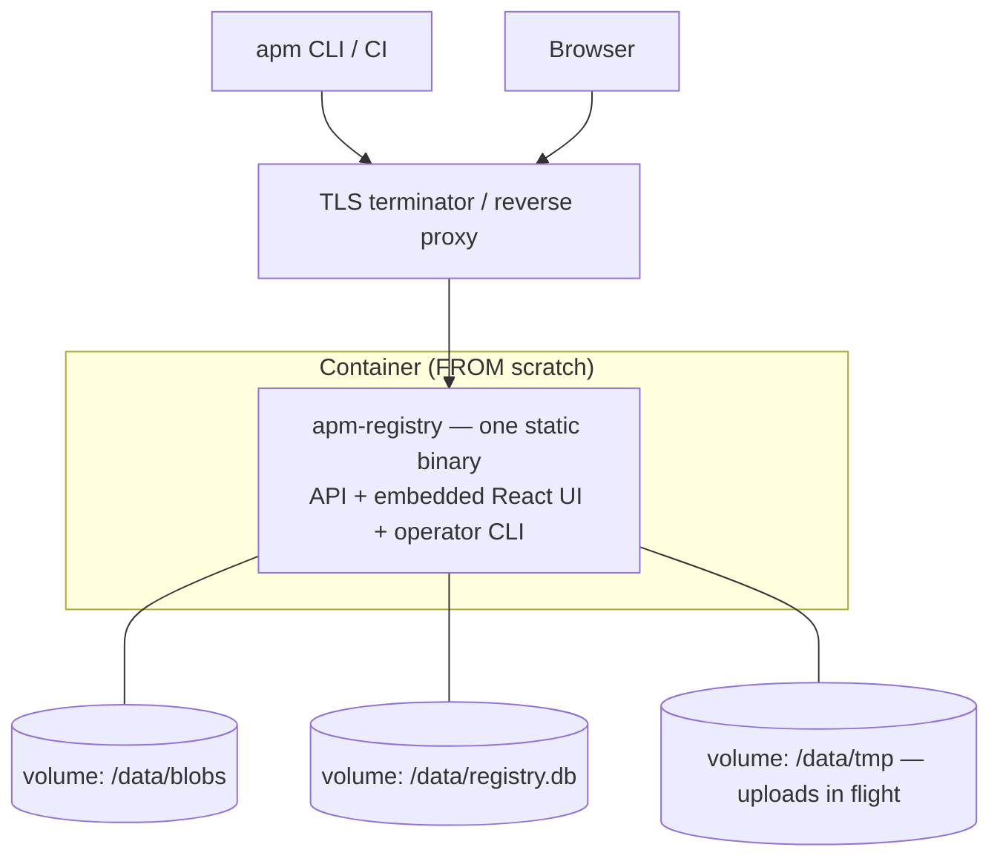

# Architecture

Implements [02-requirements.md](02-requirements.md). Decisions are recorded in
[adr/](adr/); this document describes the resulting system.

## 1. Architectural drivers

Five forces shape everything below.

| # | Driver | Consequence |
|---|---|---|
| 1 | **`req-rg-001` — bytes are immutable and digest-accurate, forever.** Consumer lockfiles record `resolved_url` + `resolved_hash`; a byte change silently breaks every frozen install. | Content-addressed storage ([ADR-0003](adr/0003-content-addressed-storage.md)); uniqueness enforced by DB constraint ([TR-08](02-requirements.md#tr-08)); no transcoding, ever ([FR-07](02-requirements.md#fr-07)). |
| 2 | **The client is fixed and external.** We cannot patch the `apm` CLI. It reads only `snake_case` and silently ignores variants. | The wire contract is a hard boundary with its own conformance suite ([TR-22](02-requirements.md#tr-22)). Response shapes are typed and tested, not incidental. |
| 3 | **Publish input is hostile.** Archives are attacker-controlled: zip slip, symlinks, zip bombs, header mismatches. | A dedicated validation pipeline runs before persistence ([ADR-0011](adr/0011-publish-pipeline.md)), streaming and bounded throughout. |
| 4 | **Two front doors, one meaning.** HTTP API and web UI must never diverge in what "publish" means. | Both are thin adapters over one application service ([ADR-0014](adr/0014-react-spa.md), [FR-34](02-requirements.md#fr-34)). |
| 5 | **The upstream spec is young.** `MS-API` is v1-implementable but OpenAPM v0.1 declares the wire contract non-normative until v0.2, which will change archive format, add yank and add attestations. | Version the API prefix ([FR-54](02-requirements.md#fr-54)); reserve schema columns for yank/attestations; isolate format policy in one module ([ADR-0004](adr/0004-archive-format.md)). |

## 2. Context



**Trust boundaries.** Everything crossing into the system from `Clients` is
untrusted: tokens, identities, version selectors and — most sharply — archive
bytes. The blob store is trusted for *integrity* only because we verify it
(`apm-registry verify`, [FR-44](02-requirements.md#fr-44)).

## 3. Layering

Ports-and-adapters, expressed the Go way: **interfaces are declared in the
package that consumes them**, and implementations live in `internal/store/`.
There is no `ports` package. The rule stays one-directional: **outer layers
depend on inner ones; `domain` imports nothing of ours.**



Why this matters concretely, rather than as ceremony:

- **`PublishService` is called by three inbound adapters.** Because it owns the
  rules, HTTP publish, web upload and a future CLI import cannot drift
  ([FR-34](02-requirements.md#fr-34)).
- **`Clock` and `IDGenerator` are interfaces** so `published_at` and ids are
  deterministic in tests. Publish assertions compare exact response bodies.
- **The domain imports no `net/http` and no `database/sql`.** Validation rules
  are pure functions over parsed input, so the eight publish checks are
  unit-testable without a server or a database. `internal/domain` importing
  `net/http` is a design regression worth failing review over.
- **Interfaces stay small and consumer-side.** `PublishService` declares the
  narrow `BlobStore` it needs rather than importing a fat store package, which
  is what keeps the in-memory fakes trivial.

### Error translation

The domain returns typed errors (`ErrVersionConflict`, `ErrArchiveInvalid` with
a slice of rule failures, `ErrScopeDenied` carrying the required scope,
`ErrNotFound`, `ErrPayloadTooLarge`, `ErrUnsupportedMediaType`), matched with
`errors.Is` / `errors.As`. Exactly one place maps them to the wire:

- **`writeProblem(w, status, title, detail, ext)`** — already in
  `internal/server`. Every error path goes through it; `http.Error` and bare
  JSON error objects are not acceptable ([FR-26](02-requirements.md#fr-26),
  [ADR-0006](adr/0006-rfc7807-errors.md)).
- The `/ui/api` surface uses **the same envelope**. The React client renders
  field-level messages from `extensions.errors[]` rather than the server
  producing a second error shape.

One taxonomy, one envelope, two presentations. A new error kind cannot reach a
client half-defined, and the UI cannot invent statuses the API does not have.

## 4. Module layout

Existing files are marked ✔; the rest is the target shape. The layout **extends**
`internal/server` rather than replacing it.

```
main.go                       ✔ server lifecycle; becomes the CLI dispatcher (M7)
Makefile                      ✔ check = build vet test
go.mod                        ✔ github.com/xgentic/agent-package-manager-registry
│
internal/
├── config/
│   └── config.go               # env parsing + startup validation (fail fast)
│
├── domain/                     # pure: imports no net/http, no database/sql
│   ├── identity.go             # PackageIdentity: parse, canonicalise, validate
│   ├── version.go              # VersionSelector: opaque, case-sensitive
│   ├── digest.go               # Digest: sha256:<hex>, subtle.ConstantTimeCompare
│   ├── scope.go                # Scope grammar + Satisfies()
│   ├── manifest.go             # apm.yml parse + required-field validation
│   ├── validation.go           # the 8 publish rules (MS-API §6)
│   ├── errors.go               # typed error taxonomy (errors.Is / errors.As)
│   └── archive/
│       ├── mediatype.go        # zip | gzip policy (ADR-0004)
│       ├── zip.go              # wraps archive/zip — central directory
│       ├── targz.go            # wraps compress/gzip + archive/tar
│       ├── entryrules.go       # traversal / symlink / hardlink / bomb rules
│       └── inventory.go        # .apm/ primitive inventory (FR-31)
│
├── service/                    # interfaces declared here, beside their consumer
│   ├── publish.go              # PublishService — Inspect() and Publish()
│   ├── query.go                # ListVersions, GetVersion, OpenDownload, Search
│   ├── token.go
│   ├── repository.go
│   └── fakes_test.go           # in-memory MetadataStore / BlobStore
│
├── store/
│   ├── sqlite/                 # database/sql + modernc.org/sqlite
│   │   ├── store.go            # MetadataStore implementation
│   │   └── migrations/         # numbered, forward-only
│   └── blob/
│       └── fs.go               # content-addressed filesystem BlobStore
│
├── server/                   ✔ the HTTP layer
│   ├── server.go             ✔ routing + wiring (ServeMux)
│   ├── problem.go            ✔ writeProblem — RFC 7807 (move out of server.go)
│   ├── identity.go             # dual-form identity route registration (§6)
│   ├── versions.go             # GET  /v1/packages/.../versions
│   ├── download.go             # GET  /v1/packages/.../versions/{v}/download
│   ├── publish.go              # PUT  /v1/packages/.../versions/{v}
│   ├── search.go               # GET  /v1/search  (vendor extension)
│   ├── uiapi.go                # /ui/api — web UI backend (ADR-0014)
│   └── middleware.go           # auth seam, request id, rate limit, recovery
│
├── webui/
│   └── embed.go                # //go:embed dist + SPA fallback
│
└── conformance/                # MS-API §9 groups, runnable against any base URL
    └── testdata/archives/      # malicious fixtures (TR-25)

web/                            # React + TypeScript + Vite source → web/dist
```

Go convention puts tests beside the code as `*_test.go`, so there is no mirrored
`test/` tree. Two deliberate exceptions:

- **`internal/conformance/`** is a package of its own, because it must run
  against a `httptest.Server` *or* a remote deployment
  ([TR-22](02-requirements.md#tr-22)) — it is a contract suite, not a unit test.
- **`testdata/`** holds the malicious archives; the Go tool ignores `testdata`
  directories, so hostile fixtures never get compiled or vetted.

## 5. Data model



| Table | Key columns | Notes |
|---|---|---|
| `repositories` | `id`, `name` UNIQUE, `visibility`, `quota_bytes`, `created_at` | `name` matches `^[a-z0-9][a-z0-9._-]*$` ([FR-30](02-requirements.md#fr-30)). |
| `packages` | `id`, `repository_id`, `identity`, `owner`, `repo`, `description`, `created_at`; UNIQUE `(repository_id, identity)` | `identity` stored **decoded and lowercased** — the canonical form ([FR-16](02-requirements.md#fr-16)). |
| `versions` | `id`, `package_id`, `version`, `digest`, `size_bytes`, `media_type`, `published_at`, `published_by_token_id`, `manifest_json`, `yanked_at` NULL; **UNIQUE `(package_id, version)`** | The unique constraint *is* the immutability guarantee ([TR-08](02-requirements.md#tr-08)). `version` is `BINARY`/case-sensitive collation. `yanked_at` reserved, unused in v1 ([FR-52](02-requirements.md#fr-52)). |
| `blobs` | `digest` PK, `size_bytes`, `created_at` | Content-addressed. Multiple versions may share a digest; deletion is refcount-driven. |
| `primitives` | `id`, `version_id`, `type`, `name`, `path` | Inventory from `.apm/`, computed once at publish ([FR-31](02-requirements.md#fr-31)). |
| `tokens` | `id`, `name`, `secret_hash`, `scopes`, `owner_user_id`, `created_at`, `expires_at`, `revoked_at`, `last_used_at` | argon2id hash; plaintext never stored ([TR-17](02-requirements.md#tr-17)). |
| `users` | `id`, `email`, `password_hash`, `is_operator` | Web UI only; API auth is token-based. |
| `sessions` | `id`, `user_id`, `expires_at` | Cookie sessions ([FR-41](02-requirements.md#fr-41)). |
| `audit_events` | `id`, `ts`, `actor_token_id`, `actor_user_id`, `action`, `repository`, `identity`, `version`, `digest`, `client_ip`, `outcome` | Append-only; no token plaintext ([FR-46](02-requirements.md#fr-46), [FR-47](02-requirements.md#fr-47)). |
| `version_tombstones` | `package_id`, `version`, `deleted_at`, `deleted_by` | Break-glass deletion ([UC-21](01-use-cases.md#uc-21-delete-a-version-break-glass)). Blocks reuse of a deleted tuple so a lockfile can never resolve to *different* bytes under a version it once saw. |

Two modelling notes that are load-bearing rather than stylistic:

1. **`version` collation must be case-sensitive and exact.** Selectors are
   opaque and case-sensitive ([FR-17](02-requirements.md#fr-17)). A default
   case-insensitive collation would silently merge `V1.0` and `v1.0`, and the
   unique constraint would reject a legitimate publish.
2. **Publish uniqueness is checked against `versions` *and* `version_tombstones`.**
   Otherwise deletion would reopen the tuple for different bytes and violate
   `req-rg-001`.

## 6. Package identity routing

`MS-API §1.2` requires two path shapes for the same resource: two segments for
GitHub identity, one percent-encoded segment otherwise. This is the subtlest part
of the HTTP layer, so the mechanics are recorded here.

**Verified behaviour** — measured on Go 1.25.4, `net/http.ServeMux` with Go 1.22+
patterns (full detail in [ADR-0007](adr/0007-package-identity.md)):

| Request path | Matches | `r.PathValue(...)` | `r.URL.Path` |
|---|---|---|---|
| `/v1/packages/acme/web-skills/versions` | `{owner}/{repo}` | `acme`, `web-skills` | 4 segments |
| `/v1/packages/gitlab.com%2Facme%2Fweb-skills/versions` | `{identity}` | `gitlab.com/acme/web-skills` | **6 segments** |
| `/v1/packages/acme%2F..%2Fevil/versions` | `{identity}` → **200** | `acme/../evil` | traversal visible |

- `ServeMux` matches against the **escaped** path, so `%2F` is not treated as a
  separator and the encoded identity matches as a *single* wildcard segment.
  `r.URL.RawPath` retains the original encoding when it differs from `r.URL.Path`.
- `r.PathValue()` returns the **decoded** value.

Therefore each endpoint registers **two** patterns, both funnelling into one
handler through a shared identity resolver:

```
GET /v1/packages/{owner}/{repo}/versions      →  identity = owner + "/" + repo
GET /v1/packages/{identity}/versions          →  identity = decoded PathValue
```

Three rules follow, all security-relevant:

1. **Validate after decoding, never before.** Row 3 above is the proof:
   `acme%2F..%2Fevil` matches, returns 200, and hands the handler
   `acme/../evil`. Traversal checks must run on that decoded output
   ([FR-15](02-requirements.md#fr-15)); validating the raw segment would pass it.
2. **Never route or validate from `r.URL.Path`.** It is already decoded and reads
   as six segments for a percent-encoded identity. Handlers use `PathValue`.
3. **Canonicalise before lookup.** Both forms lowercase to the same stored
   `identity`, so `acme/web-skills` and `acme%2Fweb-skills` are the same package
   ([FR-16](02-requirements.md#fr-16)).

`ServeMux` prefers the more specific pattern, so a plain GitHub identity never
falls into the single-segment handler — no manual ordering required.

## 7. Request flows

### 7.1 Publish

```mermaid
sequenceDiagram
  autonumber
  participant C as apm CLI
  participant H as ServeMux handler
  participant A as auth middleware
  participant P as PublishService
  participant V as validation (domain)
  participant B as BlobStore
  participant D as MetadataStore

  C->>H: PUT /v1/packages/acme/skills/versions/1.2.0<br/>Content-Type: application/zip
  H->>A: resolve principal
  A-->>H: Principal{token_id, scopes}
  H->>H: check publish:acme/skills → else 403
  H->>H: check media type → else 415
  H->>P: publish(repo, identity, version, stream, mediaType)
  P->>P: stream → temp file, SHA-256 incrementally,<br/>abort at size cap (413)
  P->>V: inspect archive (central directory / tar entries)
  V->>V: 8 rules: apm.yml at root, YAML valid,<br/>name+version, name matches identity,<br/>no traversal/symlink, caps
  alt any rule fails
    V-->>P: ArchiveInvalid(errors[])
    P->>P: delete temp file
    P-->>C: 422 problem+json, extensions.errors[]
  else valid
    P->>V: extract .apm/ primitive inventory
    P->>B: put(digest, tempFile)   %% content-addressed, no-op if present
    P->>D: BEGIN; insert version (UNIQUE package_id,version); insert primitives; audit; COMMIT
    alt unique constraint violation
      D-->>P: conflict
      P-->>C: 409 problem+json, extensions.previous_*
    else committed
      P-->>C: 201 {package, version, digest, published_at, size_bytes}
    end
  end
```

Ordering is deliberate:

- **Auth and media type before reading the body.** A caller lacking scope should
  not be able to make us ingest 50 MB.
- **Hash while streaming.** Single pass; the archive is never fully in memory
  ([TR-09](02-requirements.md#tr-09)).
- **Validate before `BlobStore.put`.** A rejected publish leaves nothing behind
  ([FR-13](02-requirements.md#fr-13)).
- **Blob before metadata.** A blob without a row is invisible garbage `gc`
  reclaims; a row without a blob is a `404` on a version a client believes
  exists — and a broken lockfile ([TR-07](02-requirements.md#tr-07)).
- **Conflict detected by the DB constraint**, not a prior `SELECT`, so two
  concurrent publishes of the same version cannot both win
  ([TR-08](02-requirements.md#tr-08)).

### 7.2 Resolve and install



The server contributes **no** resolution logic — it returns a complete, accurate,
unmodified list ([FR-19](02-requirements.md#fr-19), [UC-06](01-use-cases.md#uc-06-resolve-a-semver-range)).
The `resolved_url` written into the lockfile must remain valid indefinitely,
which rules out signed or expiring download URLs
([UC-07](01-use-cases.md#uc-07-frozen-reinstall-from-a-lockfile)).

### 7.3 Web upload

```mermaid
sequenceDiagram
  autonumber
  participant U as React SPA
  participant W as /ui/api handler
  participant P as PublishService

  U->>W: POST /ui/api/repos/corp-main/preflight (multipart, CSRF token)
  W->>W: session cookie → Principal; check publish scope
  W->>P: Inspect(stream)  %% validate + inventory, no commit
  P-->>W: {identity, version, rules[], primitives[]}
  W-->>U: pre-flight report (confirm / cancel)
  U->>W: POST /ui/api/repos/corp-main/publish
  W->>P: Publish(...)   %% identical path to §7.1
  P-->>W: 201 or typed error
  W-->>U: digest + `apm install acme/skills#1.2.0`
```

`PublishService.Inspect()` is the same validation pipeline as `Publish()` with
the commit step omitted — one implementation, two entry points
([FR-34](02-requirements.md#fr-34), [FR-35](02-requirements.md#fr-35)), which is
what guarantees the pre-flight report predicts the publish outcome. The uploaded
temp file is retained between the two requests, keyed by its digest, and swept on
expiry ([TR-15](02-requirements.md#tr-15)).

**The `/ui/api` boundary.** These handlers exist because the registry API has no
"list all packages", no search and no archive-entry listing — and because `/v1`
is a fixed external contract that must not bend toward UI needs
([ADR-0014](adr/0014-react-spa.md)). They are adapters only: any validation logic
inside a `/ui/api` handler is a bug, since it would be a second definition of
"valid package". `/ui/api` is internal and unversioned; `/v1` is neither.

## 8. Authentication and authorisation

Credentials resolve to one `Principal{Subject, Scopes, TokenID}`, carried in the
request `context.Context`.

| Surface | Credential | Notes |
|---|---|---|
| HTTP API | `Authorization: Bearer <token>` | Opaque; argon2id-hashed lookup ([FR-20](02-requirements.md#fr-20)). |
| HTTP API | `Authorization: Basic <b64>` | MUST yield identical scopes to the equivalent bearer token ([FR-21](02-requirements.md#fr-21)). |
| Web UI | Signed `HttpOnly` `Secure` `SameSite=Lax` cookie + CSRF | Distinct from API tokens ([FR-41](02-requirements.md#fr-41)). `HttpOnly` means the SPA cannot read it — deliberately, so XSS cannot become a publish credential. |
| Anonymous | none | Permitted for `GET` on `public` repositories only ([FR-24](02-requirements.md#fr-24)). |

Authorisation is a single `Scope.Satisfies(required, granted)` predicate in the
domain, applied identically by API middleware, `/ui/api` handlers and the CLI.
`401` vs `403` is decided by *credential presence*, not by outcome, so a client
can tell "authenticate" from "not permitted" ([FR-23](02-requirements.md#fr-23)).

**Sequencing note.** The middleware and the `Scope.Satisfies` call ship in MVP 1
with a hard-coded all-scopes principal; MVP 3 replaces only the middleware body.
Handlers therefore never gain authorisation retroactively — see the roadmap's
[auth seam](../ROADMAP.md#conformance-status-by-mvp) and risk R-2.

**Discoverability.** Read denial on a private repository returns `401`, and the
web UI reports "not found" for anything outside the caller's read scope, so
absence and denial are indistinguishable ([FR-40](02-requirements.md#fr-40)).

## 9. Archive handling

Archive parsing is the hostile-input surface, so it is isolated in
`internal/domain/archive/` with no I/O beyond an `io.ReaderAt` over the temp
file. It wraps the standard library — `archive/zip`, `archive/tar`,
`compress/gzip` — rather than parsing containers by hand
([ADR-0001](adr/0001-runtime-go-net-http.md)).



Details that matter:

- **ZIP entries come from the central directory** ([TR-12](02-requirements.md#tr-12)).
  Reading only local file headers lets a crafted archive present one entry table
  to the validator and another to the extractor. `zip.NewReader(ra, size)` reads
  the central directory by construction, so this requirement is satisfied by
  using the stdlib correctly rather than by custom parsing.
- **Caps are enforced during expansion** with `io.LimitedReader`, not from
  declared sizes — `FileHeader.UncompressedSize64` and tar's `Size` are both
  attacker-controlled ([TR-13](02-requirements.md#tr-13)).
- **Link detection is per-format:** `FileHeader.Mode()&fs.ModeSymlink` for zip,
  `Typeflag` of `tar.TypeSymlink` / `tar.TypeLink` for tar.
- **All eight rules run**; the first failure does not short-circuit, because
  `422` bodies list every error so producers fix everything in one round-trip
  ([FR-10](02-requirements.md#fr-10)).
- **Consumer-side caps are enforced at publish** ([TR-14](02-requirements.md#tr-14)):
  accepting an archive that no conformant consumer can extract is a bad trade.

## 10. Configuration

Environment variables, validated at startup, failing fast
([TR-30](02-requirements.md#tr-30)).

| Variable | Default | Purpose |
|---|---|---|
| `PORT` | `3000` | Listen port. |
| `APM_REGISTRY_BASE_URL` | — | Public origin; used to build `resolved_url`-shaped links and the UI's install snippets. |
| `APM_REGISTRY_DATA_DIR` | `./data` | Root for SQLite file and blob store. |
| `APM_REGISTRY_DB_URL` | `sqlite://<data>/registry.db` | Metadata store DSN. |
| `APM_REGISTRY_BLOB_BACKEND` | `fs` | `fs` (v1) or `s3`. |
| `APM_REGISTRY_MAX_ARCHIVE_BYTES` | `52428800` (50 MB) | Compressed cap → `413`. |
| `APM_REGISTRY_MAX_UNCOMPRESSED_BYTES` | `104857600` (100 MB) | Expansion cap. |
| `APM_REGISTRY_MAX_ARCHIVE_ENTRIES` | `10000` | Entry-count cap. |
| `APM_REGISTRY_ACCEPTED_MEDIA_TYPES` | `application/zip,application/gzip` | Narrow to gzip alone to pre-comply with the OpenAPM v0.2 direction ([ADR-0004](adr/0004-archive-format.md)). |
| `APM_REGISTRY_REQUIRE_MANIFEST_VERSION_MATCH` | `true` | Enforce `apm.yml.version` == URL version (`MS-API §6.5` leaves this to policy). |
| `APM_REGISTRY_ALLOW_INSECURE_HTTP` | `false` | Dev only; must be explicit ([TR-16](02-requirements.md#tr-16)). |
| `APM_REGISTRY_SESSION_SECRET` | — | Required when the web UI is enabled. |
| `APM_REGISTRY_RATE_LIMIT_*` | — | Window and quota for `429`. |

## 11. Deployment



v1 is a **single static binary with a data directory**. `CGO_ENABLED=0` plus
pure-Go SQLite means no libc dependency, so the image can be `FROM scratch`, and
the React UI is embedded via `embed.FS` rather than served separately
([ADR-0014](adr/0014-react-spa.md)).

TLS terminates upstream; the app refuses to serve production traffic over plain
HTTP unless explicitly permitted ([TR-16](02-requirements.md#tr-16)).

**Temp space is a sizing requirement, not an afterthought.** Publish streams to a
temp file before validating ([ADR-0011](adr/0011-publish-pipeline.md)), so the
volume must hold roughly `max_archive_bytes × max_concurrent_publishes`.

**Scaling limit, stated plainly.** SQLite makes this single-instance
([TR-31](02-requirements.md#tr-31)), and it needs a **local** volume — network
filesystems have unreliable SQLite locking. Because the metadata store is an
interface, going multi-instance means adding a Postgres implementation and
shared blob storage, not a redesign. A deliberate trade for v1
([ADR-0002](adr/0002-metadata-store.md)).

## 12. Testing architecture

| Layer | Approach |
|---|---|
| Domain | Table-driven unit tests: identity parsing/canonicalisation, scope satisfaction, the eight validation rules, archive entry rules. No I/O. |
| Services | In-memory `MetadataStore` + `BlobStore` fakes, fixed `Clock`/`IDGenerator` for exact response-body assertions. |
| HTTP | `httptest.NewRequest` + `httptest.NewRecorder` against `server.New(...)` in-process — no port binding, as `internal/server/server_test.go` already does ([TR-02](02-requirements.md#tr-02)). |
| **Conformance** | `internal/conformance/` implements all six `MS-API §9` groups, asserting exact `snake_case` names ([TR-22](02-requirements.md#tr-22), [TR-23](02-requirements.md#tr-23)). |
| Adversarial | Malicious archives in `testdata/` asserted rejected ([TR-25](02-requirements.md#tr-25)). |
| Fuzz | `go test -fuzz` over archive parsing — the hostile surface, and stdlib-native. |
| Property | `sha256(download(publish(x))) == sha256(x)` over generated archives ([TR-24](02-requirements.md#tr-24)). |
| End-to-end | Real `apm` CLI publish → install against a running server ([TR-26](02-requirements.md#tr-26)). |

`make check` (`build vet test`) is the single command that must stay green.

The conformance suite is the contract's regression net. It is kept in its own
package so it can run against a `httptest.Server` **or** a remote base URL, and
so a failure reads as "we are non-conformant" rather than "a test broke".

**One Go-specific trap worth a standing test.** Struct fields marshal to their Go
names unless tagged, so an untagged `PublishedAt` silently becomes
`"PublishedAt"` on the wire. The reference client reads only `snake_case` and
**ignores unknown fields without erroring** ([FR-04](02-requirements.md#fr-04)),
so a missing `json:"published_at"` tag produces a broken install with no error
anywhere. [TR-23](02-requirements.md#tr-23) exists for exactly this.

## 13. Implementation sequence

Task-level breakdown lives in **[docs/ROADMAP.md](../ROADMAP.md)**; this is the
architectural summary. Ordered so each stage is independently verifiable and the
riskiest contract work lands first.

| Stage | Delivers | Done when | MVP |
|---|---|---|---|
| 1 | Config, store interfaces, SQLite schema + migrations, blob store | `migrate` idempotent; store round-trips a blob | 1 |
| 2 | Domain: identity, version, digest, scope, manifest | Unit tests green, incl. percent-encoded and traversal cases | 1 |
| 3 | Archive inspection + the eight validation rules | Malicious fixtures rejected ([TR-25](02-requirements.md#tr-25)) | 1 |
| 4 | `PublishService` + `QueryService` | Service tests on fakes | 1 |
| 5 | `/v1` handlers, auth **seam**, problem mapper, dual identity routing | **`MS-API §9` green except §9.5** ([TR-22](02-requirements.md#tr-22)) | 1 |
| 6 | Operator CLI: `serve`, `migrate`, `repo` | An operator can bootstrap from empty | 1 |
| 7 | `/ui/api` + React SPA: browse, upload + pre-flight | UC-12…UC-14 | 2 |
| 8 | Tokens, scopes, visibility, sessions | **§9.5 unskipped — full suite green** | 3 |
| 9 | Audit, quotas, rate limiting, `gc`, `verify` | UC-18, UC-19, UC-21 | 4 |
| 10 | Search extension, caching/ETag, E2E with the real CLI | FR-51, TR-26, TR-28 | 4 |

Two milestones matter more than the rest:

- **Stage 5** — the registry becomes usable by the real `apm` CLI. Everything
  before it is unverifiable in the way that counts; everything after is
  operability and ergonomics.
- **Stage 8** — the registry becomes *conformant*. Bearer auth is a hard `MS-API
  §5` requirement, so stages 5–7 ship a deliberately non-conformant,
  network-isolated server. The auth seam in stage 5 is what keeps stage 8 a
  middleware change rather than a rewrite (see [§8](#8-authentication-and-authorisation)).
